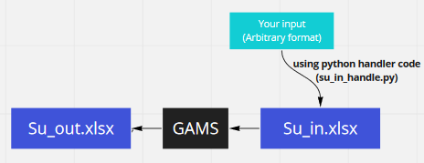

In this mini project we want to: 
- Sovle the classic 9*9 Sudoku problem using *Interger Programming*
- Send/Recieved data to/from *GAMS* software using *Python and Excel*
----------------------

1. Sovle the classic 9*9 Sudoku problem using *Interger Programming*:
For getting more insight about the mathematical model you can read the report file.
"su.gms" file is the implementaion a sudoku with GAMS software. Each line has a comment for better navigation through the code.

2. Send/Recieved data to/from *GAMS* software using *Python & Excel* 

---------------------
Special thanks to the auther of Refrence file.

Feel free to open an Isssue or send a Pull request. 

You might need a license for GAMS and there is a procedure to buy it with discount, to the best of my knowledge.
